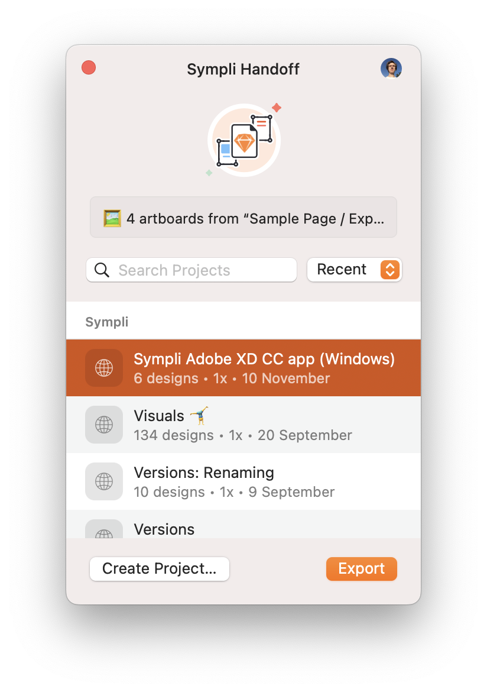

# Sympli Handoff Sketch Plugin 🔸

This repo contains a Sketch plugin for [Sympli Handoff](https://sympli.io/handoff). Feel free to open [an issue](https://github.com/sympli/sympli-sketch-plugin/issues/new/choose) if you have any questions about the plugin, have a bug to report or just want to provide feedback 🙌.

## Compatibility

The plugin supports Sketch 52 and newer but please update your Sketch.app every once in a while to access new features and performance improvements.

## Usage

### Export Artboards to Sympli

<kbd>Control + Y</kbd> or `Plugins > Sympli > Export Artboards…` to start the export process, then follow the on-screen instructions.

### Export Design System Components to Sympli

<kbd>Shift + Control + Y</kbd> or `Plugins > Sympli > Export Design System…` to start the export process, then follow the on-screen instructions.

-----

Copyright © 2015-2022 Sympli. All rights reserved.
